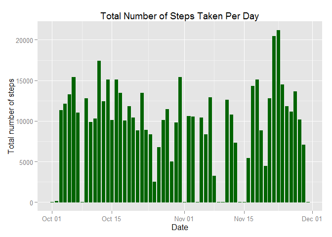
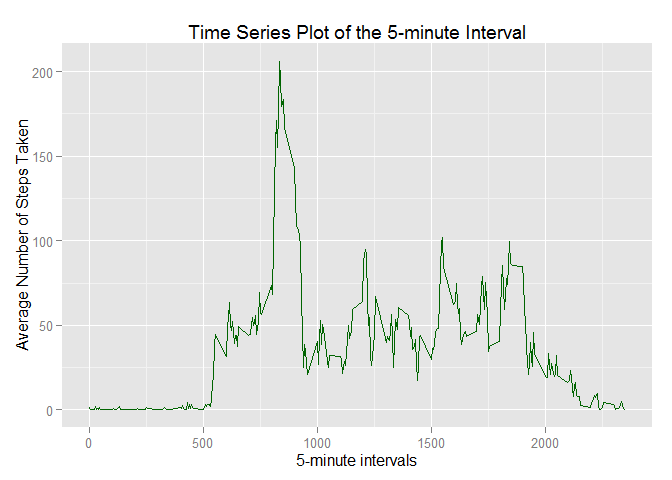
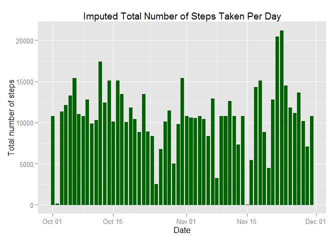
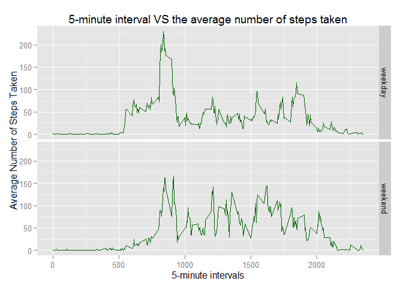

# Reproducible Research: Peer Assessment 1

```r
echo = TRUE
```
## Loading and preprocessing the data

```r
unzip("activity.zip")
data<-read.csv("activity.csv")
data$date<-as.Date(data$date)
head(data)
```

```
##   steps       date interval
## 1    NA 2012-10-01        0
## 2    NA 2012-10-01        5
## 3    NA 2012-10-01       10
## 4    NA 2012-10-01       15
## 5    NA 2012-10-01       20
## 6    NA 2012-10-01       25
```
## What is mean total number of steps taken per day?
1. Calculate the total number of steps taken per day

```r
library(ggplot2)
```

```
## Warning: package 'ggplot2' was built under R version 3.1.3
```

```r
total_steps <-aggregate(data$steps, by = list(data$date), FUN = "sum",na.rm = TRUE)
d<- ggplot(total_steps,aes(x=Group.1, y = x))
d + geom_bar(stat = "identity", colour = "darkgreen", fill = "darkgreen", width = 0.7) + labs(title = "Total Number of Steps Taken Per Day", x = "Date", y = "Total number of steps")
```

 

2. Calculate and report the mean and median of the total number of steps taken per day

```r
mean(total_steps$x)
```

```
## [1] 9354.23
```

```r
median(total_steps$x)
```

```
## [1] 10395
```

## What is the average daily activity pattern?
1. Make a time series plot (i.e. `type = "l"`) of the 5-minute interval (x-axis) and the average number of steps taken, averaged across all days (y-axis)

```r
mean_steps<-aggregate(data$steps,by = list(data$interval),FUN = "mean", na.rm = TRUE)
head(mean_steps)
```

```
##   Group.1         x
## 1       0 1.7169811
## 2       5 0.3396226
## 3      10 0.1320755
## 4      15 0.1509434
## 5      20 0.0754717
## 6      25 2.0943396
```

```r
d2<- ggplot(mean_steps,aes(x=Group.1, y = x))
d2 + geom_line(color = "darkgreen", size = 0.7) + labs(title = "Time Series Plot of the 5-minute Interval", x = "5-minute intervals", y = "Average Number of Steps Taken")
```

 

2. Which 5-minute interval, on average across all the days in the dataset, contains the maximum number of steps?

```r
mean_steps[mean_steps$x == max(mean_steps$x),]
```

```
##     Group.1        x
## 104     835 206.1698
```

## Imputing missing values
1. Calculate and report the total number of missing values in the dataset (i.e. the total number of rows with `NA`s)

```r
sum(is.na(data))
```

```
## [1] 2304
```

2. Devise a strategy for filling in all of the missing values in the dataset. The strategy does not need to be sophisticated. For example, you could use the mean/median for that day, or the mean for that 5-minute interval, etc.
3. Create a new dataset that is equal to the original dataset but with the missing data filled in.

```r
# Using the mean of 5-minute to fill in all the missing values of steps.
new_data<-data
for (i in 1:nrow(data)){
        if(is.na(new_data$steps[i])){
                new_data$steps[i] <- mean_steps[which(mean_steps$Group.1 == new_data$interval[i]),]$x
        }
}
head(new_data)
```

```
##       steps       date interval
## 1 1.7169811 2012-10-01        0
## 2 0.3396226 2012-10-01        5
## 3 0.1320755 2012-10-01       10
## 4 0.1509434 2012-10-01       15
## 5 0.0754717 2012-10-01       20
## 6 2.0943396 2012-10-01       25
```

3. Make a histogram of the total number of steps taken each day and Calculate and report the **mean** and **median** total number of steps taken per day. Do these values differ from the estimates from the first part of the assignment? What is the impact of imputing missing data on the estimates of the total daily number of steps?

```r
total_steps_new <-aggregate(new_data$steps, by = list(new_data$date), FUN = "sum")
d3<- ggplot(total_steps_new,aes(x=Group.1, y = x))
d3 + geom_bar(stat = "identity", colour = "darkgreen", fill = "darkgreen", width = 0.7) + labs(title = "Imputed Total Number of Steps Taken Per Day", x = "Date", y = "Total number of steps")
```

 

```r
mean(total_steps_new$x)
```

```
## [1] 10766.19
```

```r
median(total_steps_new$x)
```

```
## [1] 10766.19
```
The mean and median are higher than the previous data. It is because when calculating the mean and median of the orignal data, the function sets default value -- 0 if there is no step data available for that day. Therefore, the original data's mean value is lower.

## Are there differences in activity patterns between weekdays and weekends?
1. Create a new factor variable in the dataset with two levels - "weekday" and "weekend" indicating whether a given date is a weekday or weekend day.

```r
new_data$weekday <- factor(format(new_data$date,'%A'))
head(new_data)
```

```
##       steps       date interval weekday
## 1 1.7169811 2012-10-01        0  Monday
## 2 0.3396226 2012-10-01        5  Monday
## 3 0.1320755 2012-10-01       10  Monday
## 4 0.1509434 2012-10-01       15  Monday
## 5 0.0754717 2012-10-01       20  Monday
## 6 2.0943396 2012-10-01       25  Monday
```

2. Make a panel plot containing a time series plot (i.e. `type = "l"`) of the 5-minute interval (x-axis) and the average number of steps taken, averaged across all weekday days or weekend days (y-axis).

```r
levels(new_data$weekday) <- list(weekday = c("Monday", "Tuesday","Wednesday", "Thursday", "Friday"), weekend = c("Saturday", "Sunday"))
table(new_data$weekday)
```

```
## 
## weekday weekend 
##   12960    4608
```

```r
mean_steps <- aggregate(new_data$steps, list(interval = as.numeric(as.character(new_data$interval)), weekday = new_data$weekday), FUN = "mean")
head(mean_steps)
```

```
##   interval weekday          x
## 1        0 weekday 2.25115304
## 2        5 weekday 0.44528302
## 3       10 weekday 0.17316562
## 4       15 weekday 0.19790356
## 5       20 weekday 0.09895178
## 6       25 weekday 1.59035639
```

```r
d4<-ggplot(mean_steps,aes(interval,x))
d4+geom_line(color = "darkgreen", size = 0.7)+facet_grid(weekday~.) + labs(title = "5-minute interval VS the average number of steps taken", x = "5-minute intervals", y = "Average Number of Steps Taken")
```

 
